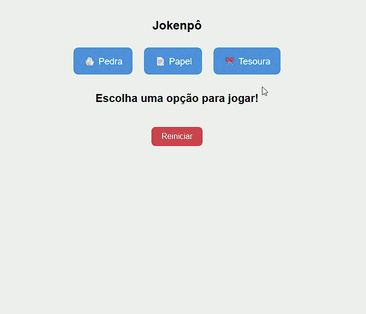

# 🎮 Jokenpô

Este projeto é um jogo de **Jokenpô (Pedra, Papel e Tesoura)** desenvolvido com **HTML, CSS e JavaScript**, incluindo uma animação em **Canvas** onde o ícone vencedor colide com o perdedor e o remove da tela. O canvas aparece apenas durante a jogada e desaparece ao reiniciar.

---

## 🚀 Funcionalidades

- Escolha entre **Pedra**, **Papel** ou **Tesoura**
- Escolha aleatória do computador
- Canvas exibido apenas durante a rodada
- Animação de colisão entre vencedor e perdedor
- Resultado mostrado na tela
- Botão **Reiniciar** limpa a interface e remove o canvas

---

## 🧭 Estrutura do Projeto
```
jokenpo-animado/
├── index.html
├── style.css
└── script.js
```

---

## 🛠 Tecnologias Utilizadas

- HTML5  
- CSS3  
- JavaScript  
- Canvas API

---

## ▶️ Como Executar

### Clonar o repositório
```bash
git clone https://github.com/SEU-USUARIO/jokenpo-animado.git
```

### Acessar a pasta
```
cd jokenpo-animado
```

### Abrir o projeto
Abra o arquivo **index.html** no navegador.

---

## 🧩 Como Jogar

1. Clique em **Pedra**, **Papel** ou **Tesoura**.  
2. O canvas aparece automaticamente mostrando os ícones animados.  
3. O vencedor avança até colidir com o perdedor.  
4. O perdedor desaparece da tela.  
5. O resultado é exibido.  
6. Clique em **Reiniciar** para jogar novamente.  

---

## 💡 Detalhes Técnicos

- Os cliques do usuário são capturados com `addEventListener("click")`.  
- O canvas é exibido ao iniciar uma jogada e ocultado ao reiniciar.  
- A animação utiliza loops de atualização com `setInterval`.  
- O perdedor é removido da renderização após a colisão, sem deixar “rastro”.  
- Emojis foram usados como ícones do jogo.  

---

## ✨ Possíveis Melhorias

- Trocar emojis por sprites personalizados  
- Adicionar efeitos sonoros ou partículas  
- Melhorar responsividade do layout  
- Organizar a lógica em módulos separados  

---

## 📸 Demonstração (Opcional)



---

## 📜 Licença

Projeto livre para uso, estudo e modificação.

---

## 📬 Contato

Sugestões e melhorias são bem-vindas! Abra uma **issue** ou **pull request** no repositório.
